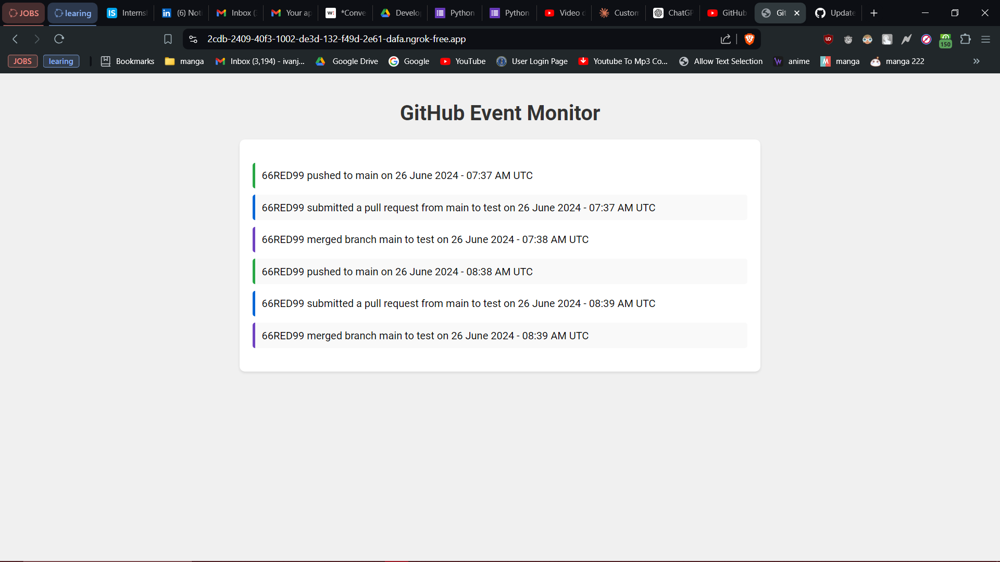
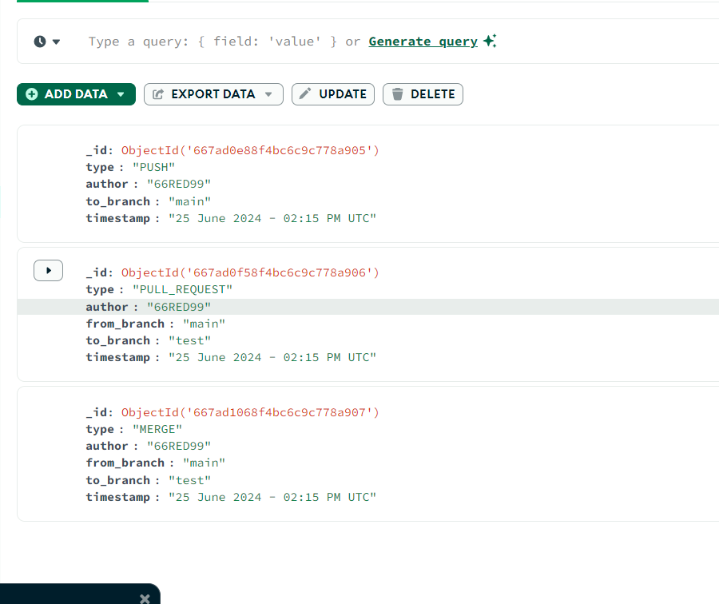

# GitHub Webhook Event Dashboard

## Overview

This project implements a GitHub webhook receiver that captures push, pull request, and merge events from a GitHub repository. It stores these events in a MongoDB database and displays them in real-time on a web interface..

### Key Features
- Developed a real-time event monitoring system for GitHub using Flask and MongoDB.
- Implemented a webhook receiver to capture push, pull request, and merge events from GitHub repositories.
- Designed and maintained a MongoDB database to store and manage event data.
- Created a dynamic web interface with JavaScript to display real-time updates of GitHub events.

## Synopsis
The entire synopisi video can be found here: https://youtu.be/M3fhCidE1Fs

## Screenshots

### Interface

### MongoDB data

## Technologies Used

- **Python**
- **Flask**
- **HTML**
- **MongoDB**
- **Javascript**

## Project Details

- **Duration**: 1 week in June 2024

